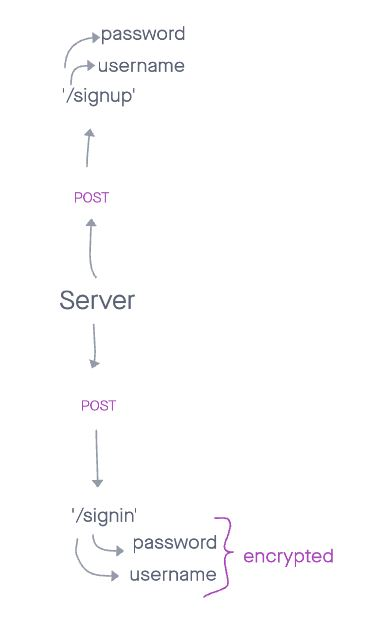

# basic-auth

Deploy an Express server that implements Basic Authentication, with signup and signin capabilities, using a Postgres database for storage.

---

## Routes

### /signup

* req, res, next
* JSON response: {"username":"value", "password":"value"}

### /signin

* req, res, next
* JSON response: none
* Authentication: basic (username and password)

--- 

## URLs

[Deployed page here](https://timegorov-basic-auth.herokuapp.com)
